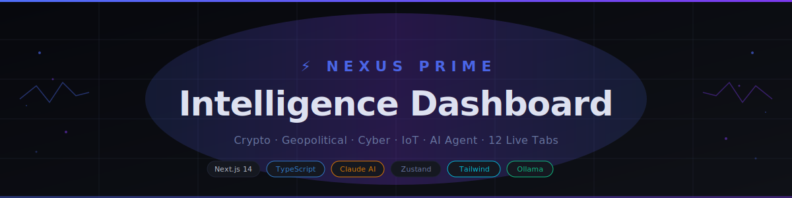
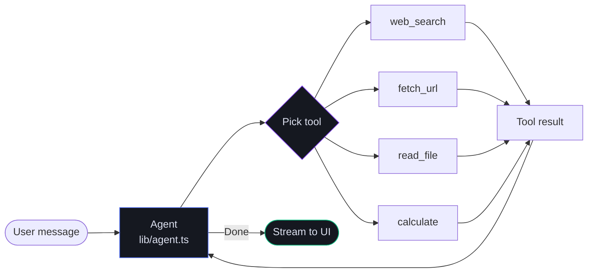

<div align="center">



<br>

[](https://nextjs.org)
[](https://typescriptlang.org)
[](https://tailwindcss.com)
[](https://anthropic.com)
[](https://ollama.ai)
[](LICENSE)

<br>

**A personal intelligence dashboard that runs entirely on your machine.**
Live crypto, geopolitical, cyber, IoT, and market data — unified in one dark UI with a built-in AI agent.

[Quickstart](#quickstart) · [Tabs](#tabs) · [AI Agent](#ai-agent) · [Stack](#stack) · [API Keys](#api-keys) · [Structure](#project-structure)

</div>

---

## What it is

Nexus Prime is a self-hosted intelligence dashboard. It pulls live data from dozens of sources and surfaces it across 12 purpose-built tabs. An AI agent built on Claude (or Ollama for offline use) runs inside the app — it can search the web, fetch URLs, reason across data, and answer questions in a full tool-use loop.

No cloud backend. No database. Runs locally on `npm run dev`.

---

## Tabs

<table>
<tr>
<td width="50%" valign="top">

### ⚡ Command
KPI cards, Fear & Greed index, live BTC price, AI briefing, event predictor, deep research agent

### 📡 Signals
Live news feed from GDELT and The Guardian. Bias tagging (bullish / bearish / neutral), article clusters, bookmarking

### 🎯 Alpha
Momentum scanner with RSI/BB/EMA scoring, Buy Bot signals, 7-day sparklines, position sizing calculator

### 🌍 Ops
Conflict tracker, interactive world map, FX rates, commodities, OSINT panels

### 📊 Intel
Polymarket prediction odds, Porter 5 Forces, VRIO framework, BCG Matrix, SaaS lifecycle tracker

### 🔒 Cyber
Live CVEs sorted by severity (CRITICAL → LOW), OTX threat intel, CISA advisories

</td>
<td width="50%" valign="top">

### 🗂 Vault
Saved articles, persisted across sessions via Zustand

### 🌐 World
Interactive Leaflet map with live layers: earthquakes (USGS), flights (OpenSky), ships (AISstream), fires (NASA FIRMS), GPS jamming

### 🔐 Security
Security posture monitoring and threat surface overview

### 🛠 Skills
Self-learning skill engine — agent reads, writes, and improves its own skill files

### 🚗 Vehicle
Vehicle tracking and telemetry data

### 📱 IoT
Device monitoring and live sensor feeds

</td>
</tr>
</table>

---

## AI Agent

The agent runs a full **ReAct (Reason + Act) loop** — it thinks, picks a tool, executes it, reads the result, and repeats until it has an answer.



Tool calls appear as collapsible badges in the chat UI in real time. The agent works with Claude (server-side key, never exposed to the client) or a local Ollama model for fully offline use.

---

## Architecture

```mermaid
flowchart TD
    subgraph Client["Browser"]
        NAV[Sidebar Nav] --> TABS[12 Tab Pages\napp/[tab]/page.tsx]
        TABS --> STORE[Zustand Store\nstore/useStore.ts]
        STORE -->|persisted| LS[(localStorage)]
        TABS --> HOOKS[Data Hooks\nusePrices · useArticles · useCVEs]
    end

    subgraph Server["Next.js Server Routes"]
        API_AI[/api/ai\nAnthropic proxy]
        API_TOOLS[/api/tools\nweb_search · fetch_url · calculate]
        API_SEARCH[/api/search\nGDELT · Guardian]
        MIDDLEWARE[middleware.ts\nBearer auth]
    end

    subgraph AI["AI Layer"]
        CLAUDE[Claude API\nAnthropic]
        OLLAMA[Ollama\nLocal LLM]
    end

    subgraph External["Live Data Sources"]
        CG[CoinGecko\ncrypto]
        USGS[USGS\nquakes]
        GDELT[GDELT\nnews]
        NVD[NVD\nCVEs]
        OTX[AlienVault OTX\nthreat intel]
        POLY[Polymarket\nprediction markets]
    end

    HOOKS --> API_SEARCH
    TABS --> API_AI
    TABS --> API_TOOLS
    API_AI --> MIDDLEWARE
    API_TOOLS --> MIDDLEWARE
    API_AI --> CLAUDE
    API_AI --> OLLAMA
    HOOKS --> CG & USGS & GDELT & NVD & OTX & POLY

    style Client fill:#0f1117,stroke:#1e2233,color:#dde1f0
    style Server fill:#07080d,stroke:#4f6ef7,color:#dde1f0
    style AI fill:#07080d,stroke:#d97706,color:#dde1f0
    style External fill:#07080d,stroke:#1e2233,color:#6875a0
```

---

## Stack

| Layer | Tech | Why |
|-------|------|-----|
| Framework | Next.js 14 (App Router) | File-based routing, server components, API routes |
| Language | TypeScript 5 | Full type safety across client and server |
| State | Zustand | Persisted settings + session-only live data, no boilerplate |
| Styling | Tailwind CSS + Radix UI | Dark design system, accessible primitives |
| AI | Anthropic Claude or Ollama | Flexible — cloud or fully offline |
| Maps | Leaflet + react-leaflet | Interactive world map with live data layers |
| Animation | Framer Motion | Tab transitions, panel reveals |
| Notifications | Sonner | Toast system |
| Data viz | D3 + SVG sparklines | Lightweight inline charts |

---

## Quickstart

**1. Clone and install**

```bash
git clone https://github.com/mad818/personal.git
cd personal
npm install
```

**2. Configure environment**

```bash
cp .env.example .env.local
```

Edit `.env.local` with at minimum:

```env
ANTHROPIC_API_KEY=sk-ant-...   # for the AI agent
NEXUS_TOKEN=any-string          # protects /api/* routes
```

**3. Run**

```bash
npm run dev
```

Open [localhost:3000](http://localhost:3000). All tabs work — keys missing means that data source falls back silently.

---

## Local AI (fully offline)

```bash
ollama pull qwen2.5:7b
```

Then open **Settings** in the app, set provider to Local, endpoint to `http://localhost:11434/v1/chat/completions`, and model to `qwen2.5:7b`. No API key needed.

---

## API Keys

All keys are optional. The app degrades gracefully when a key is absent.

| Variable | Service | Free tier | Get one |
|----------|---------|-----------|---------|
| `ANTHROPIC_API_KEY` | Claude AI (agent + chat) | Pay-per-token | [console.anthropic.com](https://console.anthropic.com) |
| `GROQ_API_KEY` | Groq (fast inference) | Yes | [console.groq.com](https://console.groq.com/keys) |
| `NEXUS_TOKEN` | Internal API auth | n/a | Set any string |
| `CG_KEY` | CoinGecko (crypto prices) | Yes | [coingecko.com/api](https://www.coingecko.com/en/api) |
| `FINNHUB_KEY` | Finnhub (stock quotes) | Yes | [finnhub.io](https://finnhub.io) |
| `GUARDIAN_KEY` | The Guardian (news) | Yes | [open-platform.theguardian.com](https://open-platform.theguardian.com) |
| `OTX_KEY` | AlienVault OTX (threat intel) | Yes | [otx.alienvault.com](https://otx.alienvault.com) |
| `FIRECRAWL_KEY` | Firecrawl (web scraper) | Yes | [firecrawl.dev](https://firecrawl.dev) |
| `NVD_KEY` | NVD (CVE feed) | Yes | [nvd.nist.gov/developers](https://nvd.nist.gov/developers/request-an-api-key) |
| `AISSTREAM_KEY` | AISstream (live ship tracking) | Yes | [aisstream.io](https://aisstream.io) |
| `NASA_FIRMS_KEY` | NASA FIRMS (fire hotspots) | Yes | [firms.modaps.eosdis.nasa.gov](https://firms.modaps.eosdis.nasa.gov/api/area/) |

---

## Project Structure

```
app/                        ← one route per tab (Next.js App Router)
├── command/                ← ⚡ Command tab
├── signals/                ← 📡 Signals tab
├── alpha/                  ← 🎯 Alpha tab
├── ops/                    ← 🌍 Ops tab
├── intel/                  ← 📊 Intel tab
├── cyber/                  ← 🔒 Cyber tab
├── vault/                  ← 🗂 Vault tab
├── api/                    ← server routes (ai, tools, search, ...)
└── layout.tsx              ← root layout (AuthGate + Nav)

components/                 ← one folder per tab + shared UI
├── ui/                     ← buttons, cards, inputs (Radix primitives)
├── system/                 ← DataLoader, ErrorBoundary, ThemeProvider
└── nav/                    ← sidebar navigation

store/
└── useStore.ts             ← Zustand store: settings (persisted) + live data

lib/
├── ai.ts                   ← callAI, streamAI, buildSystemPrompt
├── agent.ts                ← ReAct agent loop with tool use
└── helpers.ts              ← fmtPrice, fmtVol, timeAgo, esc

.claude/skills/             ← project-level agent skills
├── add-feature/SKILL.md
├── add-tab/SKILL.md
├── add-api/SKILL.md
└── fix-bug/SKILL.md

tasks/
├── todo.md                 ← active task list
└── lessons.md              ← rules from past corrections

docs/
├── architecture.md
└── expansion-plan.md
```

---

## License

MIT
