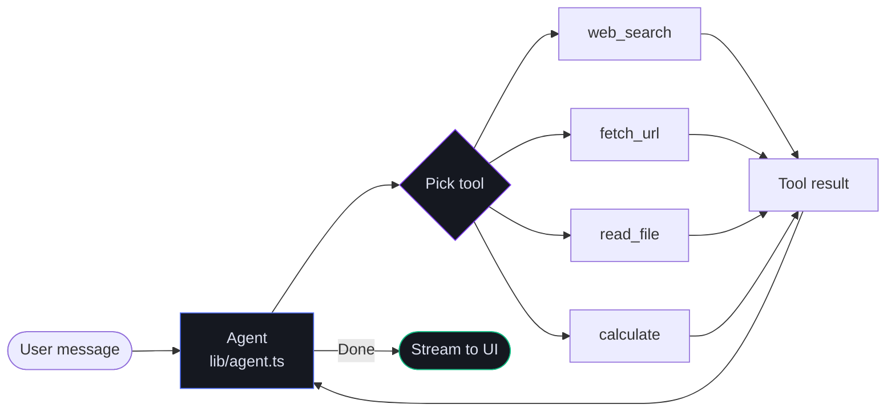
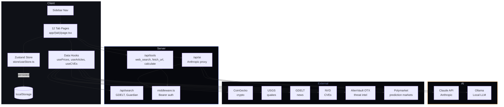

<div align="center">


<br>

[](https://nextjs.org)
[](https://typescriptlang.org)
[](https://tailwindcss.com)
[](https://anthropic.com)
[](https://platform.minimax.io)
[](https://ollama.ai)
[](LICENSE)

<br>

### At a glance *(GitHub’s short repo description is text-only — visuals live here)*


**Social preview (1280×640):** the repo card is [`public/github-social-card.svg`](./public/github-social-card.svg). In **GitHub → Settings → General → Social preview → Edit**, upload a **PNG or JPEG** (GitHub may not accept SVG there): open the SVG in a browser, export or screenshot at ~1280×640, then attach.

<br>

**A personal intelligence dashboard that runs entirely on your machine.**
Live crypto, geopolitical, cyber, and market data — plus free-tier intel maps, optional TradingView embeds, and a built-in AI agent (Claude, MiniMax, OpenAI chain, or local Ollama).

[Quickstart](#quickstart) · [API Keys](#api-keys) · [Local AI](#local-ai-fully-offline) · [Self-hosting](#self-hosting) · [Structure](#project-structure) · [Tabs](#tabs) · [AI Agent](#ai-agent) · [Stack](#stack)

</div>

---

## What it is

**Free software (MIT) — Nexus does not charge you.** There are no subscriptions, paywalls, or in-app purchases in this app. Optional API keys are bring-your-own; if a provider bills you, that is between you and them, not Nexus.

Nexus Prime is a self-hosted intelligence dashboard. It pulls live data from dozens of sources and surfaces it across purpose-built tabs. An AI agent runs inside the app (Claude, MiniMax, cloud fallbacks, or local Ollama) with tool-use for research, analysis, and code edits. The **Field manual** (`/resources`) links curated external learning resources; `.env.local` stays gitignored.

No cloud backend. No database. Runs locally on `npm run dev`.

---

## Tabs

<table>
<tr>
<td width="50%" valign="top">

### ⚡ Command
KPI cards, Fear & Greed index, live BTC price, AI briefing, event predictor, deep research agent

### 📡 Signals
Live news (RSS + CryptoCompare + GDELT fallback; optional Guardian with API key). Bias tagging (bullish / bearish / neutral), article clusters, bookmarking

### 🎯 Alpha
Momentum scanner with RSI/BB/EMA scoring, Buy Bot signals, 7-day sparklines, position sizing calculator

### 🌍 Ops
Conflict tracker, interactive world map, FX rates, commodities, OSINT panels

### 📊 Intel
Polymarket prediction odds, Porter 5 Forces, VRIO framework, BCG Matrix, SaaS lifecycle tracker

### 🔒 Cyber
Live CVEs sorted by severity (CRITICAL → LOW), OTX threat intel, CISA advisories

</td>
<td width="50%" valign="top">

### 🗂 Vault
Saved articles, persisted across sessions via Zustand

### 🌐 World
Interactive Leaflet map with live layers: earthquakes (USGS), flights (OpenSky), ships (AISstream), fires (NASA FIRMS), GPS jamming

### 🔐 Security
Security posture monitoring and threat surface overview

### 🛠 Skills
Self-learning skill engine — agent reads, writes, and improves its own skill files

### 🚗 Vehicle
Vehicle tracking and telemetry data

### 📱 IoT
Device monitoring and live sensor feeds

</td>
</tr>
</table>

---

## AI Agent

The agent runs a full **ReAct (Reason + Act) loop** — it thinks, picks a tool, executes it, reads the result, and repeats until it has an answer.


```mermaid
flowchart LR
    U([User message]) --> A[Agent\nlib/agent.ts]
    A --> T{Pick tool}
    T --> W[web_search]
    T --> F[fetch_url]
    T --> R[read_file]
    T --> C[calculate]
    W --> O[Tool result]
    F --> O
    R --> O
    C --> O
    O --> A
    A -->|Done| S([Stream to UI])
    style A fill:#151820,stroke:#4f6ef7,color:#dde1f0
    style T fill:#151820,stroke:#7c3aed,color:#dde1f0
    style S fill:#151820,stroke:#10b981,color:#dde1f0
```

Tool calls appear as collapsible badges in the chat UI in real time. The agent works with Claude (server-side key, never exposed to the client) or a local Ollama model for fully offline use.

---

## Architecture


```mermaid
flowchart TD
    subgraph Client
        NAV["Sidebar Nav"] --> TABS["12 Tab Pages<br/>app/(tab)/page.tsx"]
        TABS --> STORE["Zustand Store<br/>store/useStore.ts"]
        STORE -->|persisted| LS[("localStorage")]
        TABS --> HOOKS["Data Hooks<br/>usePrices, useArticles, useCVEs"]
    end

    subgraph Server
        API_AI["/api/ai<br/>Anthropic proxy"]
        API_TOOLS["/api/tools<br/>web_search, fetch_url, calculate"]
        API_SEARCH["/api/search<br/>GDELT, Guardian"]
        MIDDLEWARE["middleware.ts<br/>Bearer auth"]
    end

    subgraph AI
        CLAUDE["Claude API<br/>Anthropic"]
        OLLAMA["Ollama<br/>Local LLM"]
    end

    subgraph External
        CG["CoinGecko<br/>crypto"]
        USGS["USGS<br/>quakes"]
        GDELT["GDELT<br/>news"]
        NVD["NVD<br/>CVEs"]
        OTX["AlienVault OTX<br/>threat intel"]
        POLY["Polymarket<br/>prediction markets"]
    end

    HOOKS --> API_SEARCH
    TABS --> API_AI
    TABS --> API_TOOLS
    API_AI --> MIDDLEWARE
    API_TOOLS --> MIDDLEWARE
    API_AI --> CLAUDE
    API_AI --> OLLAMA
    HOOKS --> CG
    HOOKS --> USGS
    HOOKS --> GDELT
    HOOKS --> NVD
    HOOKS --> OTX
    HOOKS --> POLY

    style Client fill:#0f1117,stroke:#1e2233,color:#dde1f0
    style Server fill:#07080d,stroke:#4f6ef7,color:#dde1f0
    style AI fill:#07080d,stroke:#d97706,color:#dde1f0
    style External fill:#07080d,stroke:#1e2233,color:#6875a0
```

---

## Stack

| Layer | Tech | Why |
|-------|------|-----|
| Framework | Next.js 14 (App Router) | File-based routing, server components, API routes |
| Language | TypeScript 5 | Full type safety across client and server |
| State | Zustand | Persisted settings + session-only live data, no boilerplate |
| Styling | Tailwind CSS + Radix UI | Dark design system, accessible primitives |
| AI | Anthropic Claude or Ollama | Flexible — cloud or fully offline |
| Maps | Leaflet + react-leaflet | Interactive world map with live data layers |
| Animation | Framer Motion | Tab transitions, panel reveals |
| Notifications | Sonner | Toast system |
| Data viz | D3 + SVG sparklines | Lightweight inline charts |

---

## Quickstart

<div align="center">


</div>

| Step | What to run |
|------|-------------|
| **1. Clone & install** | `git clone https://github.com/mad818/personal.git` → `cd personal` → `npm install` |
| **2. Environment** | `cp .env.example .env.local` then edit (see [API Keys](#api-keys) and [Local AI](#local-ai-fully-offline)) |
| **3. Dev server** | `npm run dev` → open [localhost:3000](http://localhost:3000) |
| **4. Quality gate** | `npm run verify` — typecheck, lint, path-collision check (run before PRs) |
| **5. PWA (optional)** | `public/manifest.json` + `public/icon.svg` — Chrome/Edge **Install**; iOS Safari **Add to Home Screen** |

Minimum useful `.env.local` for cloud AI + protected APIs:

```env
NEXUS_TOKEN=any-long-random-string
ANTHROPIC_API_KEY=sk-ant-...
```

Missing data keys only disable that feed; the rest of the app still loads.

---

## API Keys

<div align="center">


</div>

**Source of truth:** [`.env.example`](./.env.example) (comments list provider order, defaults, and links).

| Variable | Service | Free tier | Get one |
|----------|---------|-----------|---------|
| `NEXUS_TOKEN` | Internal Bearer auth for `/api/*` | n/a | Any strong random string |
| `ANTHROPIC_API_KEY` | Claude (agent + chat) | Your Anthropic account | [console.anthropic.com](https://console.anthropic.com) |
| `MINIMAX_API_KEY` | MiniMax (OpenAI-compatible) | Per MiniMax | [platform.minimax.io](https://platform.minimax.io) |
| `OPENAI_API_KEY` | OpenAI | Per OpenAI | [platform.openai.com](https://platform.openai.com/api-keys) |
| `GROQ_API_KEY` | Groq | Yes | [console.groq.com](https://console.groq.com/keys) |
| `OPENROUTER_API_KEY` | OpenRouter gateway | Per plan | [openrouter.ai/keys](https://openrouter.ai/keys) |
| `GOOGLE_AI_KEY` | Google AI (Gemini) | Per Google | [aistudio.google.com/apikey](https://aistudio.google.com/apikey) |
| `COINGECKO_KEY` | CoinGecko | Demo tier | [coingecko.com/api](https://www.coingecko.com/en/api) |
| `FINNHUB_KEY` | Finnhub (stocks) | Yes | [finnhub.io](https://finnhub.io) |
| `GUARDIAN_KEY` | The Guardian (news) | Yes | [open-platform.theguardian.com](https://open-platform.theguardian.com) |
| `FRED_KEY` | FRED (macro) | Yes | [fred.stlouisfed.org/docs/api](https://fred.stlouisfed.org/docs/api/api_key.html) |
| `OTX_KEY` | AlienVault OTX | Yes | [otx.alienvault.com](https://otx.alienvault.com) |
| `FIRECRAWL_KEY` | Firecrawl | Yes | [firecrawl.dev](https://firecrawl.dev) |
| `BRAVE_SEARCH_KEY` | Brave Search | Per Brave | [api.search.brave.com](https://api.search.brave.com) |
| `NVD_KEY` | NVD (CVEs) | Yes | [nvd.nist.gov/developers](https://nvd.nist.gov/developers/request-an-api-key) |
| `AISSTREAM_KEY` | AISstream (ships) | Yes | [aisstream.io](https://aisstream.io) |
| `FIRMS_MAP_KEY` | NASA FIRMS (fires) | Yes | [firms.modaps.eosdis.nasa.gov](https://firms.modaps.eosdis.nasa.gov/api/area/) |

Server-side AI keys are never exposed to the browser; the client sends `Authorization: Bearer <NEXUS_TOKEN>` only.

---

## Local AI (fully offline)

<div align="center">


</div>

```bash
ollama pull qwen3:8b
# ollama serve runs by default on :11434
```

In the app: **Settings** → provider **Local** → endpoint `http://localhost:11434/v1/chat/completions` → model e.g. `qwen3:8b`. No cloud API key required for the agent. Optional model routing for tools vs chat lives in `lib/aiModelRouting.ts`.

Public map/news layers still call the internet unless you avoid those tabs or features.

---

## Self-hosting

<div align="center">


</div>

| Path | Notes |
|------|--------|
| **Coolify / VPS** | Step-by-step: **[docs/deployment/coolify.md](docs/deployment/coolify.md)** — Git deploy, **Dockerfile** or Nixpacks, port **3000**, paste the same env vars as local. |
| **Docker smoke** | `docker build -t nexus-prime .` then `docker run --rm -p 3000:3000 --env-file .env.local nexus-prime` (`.env.local` must include at least `NEXUS_TOKEN`; add AI keys as needed). |
| **Health** | `GET /api/health` — uptime check (public; no Bearer). |

Production hardening: `next.config.js` sets CSP and related headers for non-dev builds.

---

## Project structure

<div align="center">


</div>

```
app/                        ← routes + app/api/* (Next.js App Router)
├── page.tsx                ← redirects to /command
├── home/  command/  signals/  alpha/  ops/  intel/  cyber/  vault/
├── resources/  skills/  security/  vehicle/  iot/  reset/
├── api/                    ← ai, tools, search, health, ...
└── layout.tsx              ← root layout, CommandBar, nav

components/                 ← tab folders + shared UI
├── ui/                     ← Radix-based primitives, CommandBar
├── system/                 ← DataLoader, ErrorBoundary, ThemeProvider
└── nav/                    ← sidebar

store/useStore.ts           ← Zustand: persisted settings + session data

lib/
├── ai.ts  agent.ts  helpers.ts  aiModelRouting.ts  liveContext.ts  ...

.claude/skills/             ← add-feature, add-tab, add-api, fix-bug, …

tasks/                      ← todo.md, lessons.md

docs/                       ← architecture, deployment/coolify.md, ideas/

Dockerfile  .dockerignore   ← standalone Next output, port 3000

nexus-final.html            ← legacy single-file dashboard (reference)
```

---

## License

MIT
