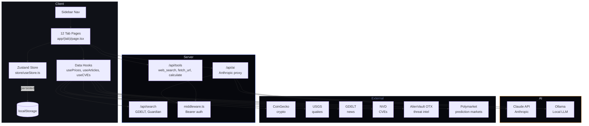

 

 

### At a glance

<a href="#quickstart">Quickstart</a> · <a href="#api-keys">API Keys</a> · <a href="#local-ai-fully-offline">Local AI</a> · <a href="#self-hosting">Self-hosting</a> · <a href="#project-structure">Structure</a> · <a href="#tabs">Tabs</a> · <a href="#ai-agent">AI Agent</a> · <a href="#stack">Stack</a>

---

## Tabs

<table>
<tr>
<td width="50%" valign="top">

### ⚡ Command
KPI cards, Fear & Greed index, live BTC price, AI briefing, event predictor, deep research agent

### 📡 Signals
Live news (RSS + CryptoCompare + GDELT fallback; optional Guardian with API key). Bias tagging (bullish / bearish / neutral), article clusters, bookmarking

### 🎯 Alpha
Momentum scanner with RSI/BB/EMA scoring, Buy Bot signals, 7-day sparklines, position sizing calculator

### 🌍 Ops
Conflict tracker, interactive world map, FX rates, commodities, OSINT panels

### 📊 Intel
Polymarket prediction odds, Porter 5 Forces, VRIO framework, BCG Matrix, SaaS lifecycle tracker

### 🔒 Cyber
Live CVEs sorted by severity (CRITICAL → LOW), OTX threat intel, CISA advisories

</td>
<td width="50%" valign="top">

### 🗂 Vault
Saved articles, persisted across sessions via Zustand

### 🌐 World
Interactive Leaflet map with live layers: earthquakes (USGS), flights (OpenSky), ships (AISstream), fires (NASA FIRMS), GPS jamming

### 🔐 Security
Security posture monitoring and threat surface overview

### 🛠 Skills
Self-learning skill engine — agent reads, writes, and improves its own skill files

### 🚗 Vehicle
Vehicle tracking and telemetry data

### 📱 IoT
Device monitoring and live sensor feeds

</td>
</tr>
</table>

---

## AI Agent

The agent runs a full **ReAct (Reason + Act) loop** — it thinks, picks a tool, executes it, reads the result, and repeats until it has an answer.

```mermaid
flowchart LR
    U([User message]) --> A[Agent\nlib/agent.ts]
    A --> T{Pick tool}
    T --> W[web_search]
    T --> F[fetch_url]
    T --> R[read_file]
    T --> C[calculate]
    W --> O[Tool result]
    F --> O
    R --> O
    C --> O
    O --> A
    A -->|Done| S([Stream to UI])
    style A fill:#151820,stroke:#4f6ef7,color:#dde1f0
    style T fill:#151820,stroke:#7c3aed,color:#dde1f0
    style S fill:#151820,stroke:#10b981,color:#dde1f0
```

Tool calls appear as collapsible badges in the chat UI in real time. The agent works with Claude (server-side key, never exposed to the client) or a local Ollama model for fully offline use.

---

## Architecture

```mermaid
flowchart TD
    subgraph Client
        NAV["Sidebar Nav"] --> TABS["12 Tab Pages<br/>app/(tab)/page.tsx"]
        TABS --> STORE["Zustand Store<br/>store/useStore.ts"]
        STORE -->|persisted| LS[("localStorage")]
        TABS --> HOOKS["Data Hooks<br/>usePrices, useArticles, useCVEs"]
    end

    subgraph Server
        API_AI["/api/ai<br/>Anthropic proxy"]
        API_TOOLS["/api/tools<br/>web_search, fetch_url, calculate"]
        API_SEARCH["/api/search<br/>GDELT, Guardian"]
        MIDDLEWARE["middleware.ts<br/>Bearer auth"]
    end

    subgraph AI
        CLAUDE["Claude API<br/>Anthropic"]
        OLLAMA["Ollama<br/>Local LLM"]
    end

    subgraph External
        CG["CoinGecko<br/>crypto"]
        USGS["USGS<br/>quakes"]
        GDELT["GDELT<br/>news"]
        NVD["NVD<br/>CVEs"]
        OTX["AlienVault OTX<br/>threat intel"]
        POLY["Polymarket<br/>prediction markets"]
    end

    HOOKS --> API_SEARCH
    TABS --> API_AI
    TABS --> API_TOOLS
    API_AI --> MIDDLEWARE
    API_TOOLS --> MIDDLEWARE
    API_AI --> CLAUDE
    API_AI --> OLLAMA
    HOOKS --> CG
    HOOKS --> USGS
    HOOKS --> GDELT
    HOOKS --> NVD
    HOOKS --> OTX
    HOOKS --> POLY

    style Client fill:#0f1117,stroke:#1e2233,color:#dde1f0
    style Server fill:#07080d,stroke:#4f6ef7,color:#dde1f0
    style AI fill:#07080d,stroke:#d97706,color:#dde1f0
    style External fill:#07080d,stroke:#1e2233,color:#6875a0
```

---

## Stack

---

## Quickstart

---

## API Keys

---

## Local AI (fully offline)

---

## Self-hosting

---

## Project structure

---

## License

MIT
