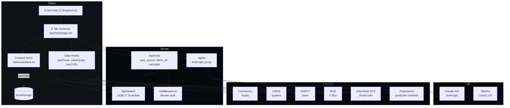

<div align="center">


<br>

[](https://nextjs.org)
[](https://typescriptlang.org)
[](https://tailwindcss.com)
[](https://anthropic.com)
[](https://platform.minimax.io)
[](https://ollama.ai)
[](LICENSE)

<br>

### At a glance


<p align="center"><sub><a href="#quickstart">Quickstart</a> · <a href="#api-keys">API Keys</a> · <a href="#local-ai-fully-offline">Local AI</a> · <a href="#self-hosting">Self-hosting</a> · <a href="#project-structure">Structure</a> · <a href="#tabs">Tabs</a> · <a href="#ai-agent">AI Agent</a> · <a href="#stack">Stack</a></sub></p>

</div>

**Hybrid layout:** the SVGs above are the visual map; the sections below repeat the same facts in text so you can search, copy commands, and skim without loading images.

## What it is

**Nexus Prime** is a self-hosted intelligence dashboard (Next.js 14, MIT). There is no Nexus subscription: optional APIs are bring-your-own. Live markets, geopolitics, cyber, maps, and a multi-provider **AI agent** (Claude, MiniMax, OpenAI-family chain, or **Ollama** offline) run on your machine — no cloud app backend, no database. Curated learning links live at **`/resources`**; secrets stay in **`.env.local`** (gitignored).

---

## Tabs

The nav bar shows **6 items**. OPS and INTEL are dropdowns that expand to reveal sub-tabs — keeping the bar compact while all 9 surfaces remain one click away.

<table>
<tr>
<td width="50%" valign="top">

### 🤖 Home
Personal AI assistant. Ask anything: markets, goals, threat intel, motivation. Streams tool calls live.

### ⚡ Command
KPI cards, Fear & Greed index, live BTC price, AI briefing, event predictor, deep research agent.

### 📡 Signals
Live news (RSS + GDELT fallback; optional Guardian key). Bias tagging (bullish / bearish / neutral), story threads, article clusters, bookmarking.

### 🎯 Alpha
Momentum scanner with RSI/BB/EMA scoring, Buy Bot signals, 7-day sparklines, position sizing calculator.

</td>
<td width="50%" valign="top">

### 🌍 OPS ▾ (dropdown)
**World Map** — interactive Leaflet map with live layers: earthquakes (USGS), flights (OpenSky), ships (AIS), fires (NASA FIRMS), GPS jamming, space weather.
**Cyber** — live CVEs (CRITICAL → LOW), OTX threat intel, CISA KEV advisories.
**Recon** — OSINT toolkit: RDAP/WHOIS, DNS, crt.sh cert transparency, IP geo (all free). HIBP breach check, VirusTotal, Shodan (BYOK). Local WebRTC leak probe + fingerprint entropy + OPSEC score.

### 📊 INTEL ▾ (dropdown)
**Strategy** — Polymarket prediction odds, Porter 5 Forces, VRIO, BCG Matrix, SaaS lifecycle tracker.
**Vault** — bookmarked articles, persisted across sessions.

</td>
</tr>
</table>

---

## AI Agent

The agent runs a full **ReAct (Reason + Act) loop** — it thinks, picks a tool, executes it, reads the result, and repeats until it has an answer.


```mermaid
flowchart LR
    U([User message]) --> A[Agent\nlib/agent.ts]
    A --> T{Pick tool}
    T --> W[web_search]
    T --> F[fetch_url]
    T --> R[read_file]
    T --> C[calculate]
    W --> O[Tool result]
    F --> O
    R --> O
    C --> O
    O --> A
    A -->|Done| S([Stream to UI])
    style A fill:#151820,stroke:#4f6ef7,color:#dde1f0
    style T fill:#151820,stroke:#7c3aed,color:#dde1f0
    style S fill:#151820,stroke:#10b981,color:#dde1f0
```

Tool calls appear as collapsible badges in the chat UI in real time. The agent works with Claude (server-side key, never exposed to the client) or a local Ollama model for fully offline use.

---

## Architecture


```mermaid
flowchart TD
    subgraph Client
        NAV["6-Item Nav (2 dropdowns)"] --> TABS["9 Tab Surfaces<br/>app/(tab)/page.tsx"]
        TABS --> STORE["Zustand Store<br/>store/useStore.ts"]
        STORE -->|persisted| LS[("localStorage")]
        TABS --> HOOKS["Data Hooks<br/>usePrices, useArticles, useCVEs"]
    end

    subgraph Server
        API_AI["/api/ai<br/>Anthropic proxy"]
        API_TOOLS["/api/tools<br/>web_search, fetch_url, calculate"]
        API_SEARCH["/api/search<br/>GDELT, Guardian"]
        MIDDLEWARE["middleware.ts<br/>Bearer auth"]
    end

    subgraph AI
        CLAUDE["Claude API<br/>Anthropic"]
        OLLAMA["Ollama<br/>Local LLM"]
    end

    subgraph External
        CG["CoinGecko<br/>crypto"]
        USGS["USGS<br/>quakes"]
        GDELT["GDELT<br/>news"]
        NVD["NVD<br/>CVEs"]
        OTX["AlienVault OTX<br/>threat intel"]
        POLY["Polymarket<br/>prediction markets"]
    end

    HOOKS --> API_SEARCH
    TABS --> API_AI
    TABS --> API_TOOLS
    API_AI --> MIDDLEWARE
    API_TOOLS --> MIDDLEWARE
    API_AI --> CLAUDE
    API_AI --> OLLAMA
    HOOKS --> CG
    HOOKS --> USGS
    HOOKS --> GDELT
    HOOKS --> NVD
    HOOKS --> OTX
    HOOKS --> POLY

    style Client fill:#0f1117,stroke:#1e2233,color:#dde1f0
    style Server fill:#07080d,stroke:#4f6ef7,color:#dde1f0
    style AI fill:#07080d,stroke:#d97706,color:#dde1f0
    style External fill:#07080d,stroke:#1e2233,color:#6875a0
```

---

## Stack

<div align="center">


</div>

The graphic is the cheat sheet; in one line: **Next.js 14 App Router + TypeScript 5 + Zustand + Tailwind/Radix**, **server `/api/*` routes** for AI and tools (keys never shipped to the browser), **Leaflet** maps, **Framer Motion**, **Sonner**, **D3** sparklines. The pipeline strip under [At a glance](#at-a-glance) shows how data and LLM traffic flow.

---

## Quickstart

<div align="center">


</div>

1. **Clone & install**

```bash
git clone https://github.com/mad818/personal.git
cd personal
npm install
```

2. **Environment** — `cp .env.example .env.local`, then set at least:

```env
NEXUS_TOKEN=your-long-random-secret
ANTHROPIC_API_KEY=sk-ant-...
```

(Use [Local AI](#local-ai-fully-offline) instead of cloud keys if you want fully offline LLM.)

3. **Run** — `npm run dev` → [http://localhost:3000](http://localhost:3000). Missing *data* keys only quiet that feed.

4. **Verify** (before PRs) — `npm run verify` (typecheck, lint, path safety).

5. **PWA** — `public/manifest.json` + `public/icon.svg`; Chrome/Edge **Install**, or iOS Safari **Add to Home Screen**.

---

## API Keys

<div align="center">


</div>

- **`NEXUS_TOKEN`** — Required for the browser to call `/api/*` (Bearer token). Pick any strong random string.
- **AI providers** — `ANTHROPIC_API_KEY`, `MINIMAX_API_KEY`, `OPENAI_API_KEY`, `GROQ_API_KEY`, `OPENROUTER_API_KEY`, `GOOGLE_AI_KEY`, etc. The server tries configured providers in order and skips missing keys.
- **Data / intel** — CoinGecko, Finnhub, Guardian, FRED, OTX, NVD, Firecrawl, Brave, AISstream, FIRMS, … all **optional**; the UI degrades gracefully.

**Canonical list with comments and signup links:** [`.env.example`](./.env.example).

---

## Local AI (fully offline)

<div align="center">


</div>

```bash
ollama pull qwen3:8b
# ollama serve  (listens on :11434 by default)
```

In the app: **Settings** → **Provider: Local** → endpoint `http://localhost:11434/v1/chat/completions` → model e.g. `qwen3:8b`. Optional per-task model mapping: `lib/aiModelRouting.ts`. Map/news layers still use the public internet unless you avoid those features.

---

## Self-hosting

<div align="center">


</div>

- **Coolify / VPS** — Full walkthrough: [`docs/deployment/coolify.md`](docs/deployment/coolify.md) (Git deploy, Dockerfile or Nixpacks, port **3000**, same env vars as local).
- **Docker smoke test**

```bash
docker build -t nexus-prime .
docker run --rm -p 3000:3000 --env-file .env.local nexus-prime
```

- **Health** — `GET /api/health` (public, no Bearer).
- **Hardening** — Non-dev builds get CSP and related headers from `next.config.js`.

---

## Project structure

<div align="center">


</div>

- **`app/`** — App Router routes (`command`, `signals`, `intel`, …) plus **`app/api/*`** (AI, tools, search, health, …). Root `page.tsx` redirects to `/command`; `layout.tsx` holds shell + **CommandBar**.
- **`components/`** — Tab UI, **`ui/`** (Radix), **`system/`**, **`nav/`**.
- **`lib/`** — `ai.ts`, `agent.ts`, `helpers.ts`, `liveContext.ts`, `aiModelRouting.ts`, …
- **`store/useStore.ts`** — Zustand (persisted settings + session data).
- **Meta** — `.claude/skills/`, `tasks/`, `docs/` (including deployment), **`Dockerfile`**, **`middleware.ts`**, **`nexus-final.html`** (legacy single-file reference).

---

## License

MIT
