<div align="center">

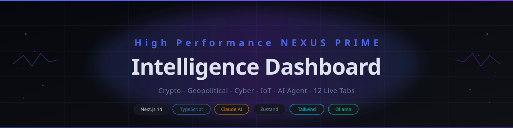

<br>

[](https://nextjs.org)
[](https://typescriptlang.org)
[](https://tailwindcss.com)
[](https://anthropic.com)
[](https://platform.minimax.io)
[](https://ollama.ai)
[](desktop/README.md)
[](LICENSE)

<br>

### At a glance

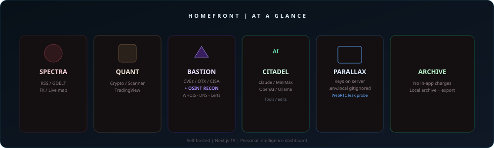

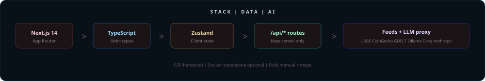

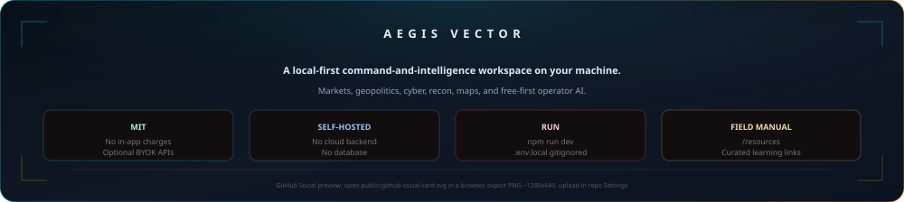

<p align="center"><sub><a href="#quickstart">Quickstart</a> · <a href="#api-keys">API Keys</a> · <a href="#local-ai-fully-offline">Local AI</a> · <a href="#self-hosting">Self-hosting</a> · <a href="#project-structure">Structure</a> · <a href="#tabs">Tabs</a> · <a href="#ai-agent">AI Agent</a> · <a href="#stack">Stack</a></sub></p>

</div>

**Hybrid layout:** the SVGs above are the visual map; the sections below repeat the same facts in text so you can search, copy commands, and skim without loading images.

## What it is

**Aegis Vector** is a local-first command-and-intelligence workspace (Next.js 14, MIT) with a native **desktop app for Windows and macOS** (Tauri). It is self-hosted, free-first, and does not charge end users in-app: optional providers are bring-your-own, and paid-compatible AI lanes stay hidden unless you explicitly opt in. Markets, geopolitics, cyber, recon, maps, and operator AI all run on your machine with no cloud app backend and no database. Run it in your browser at `localhost:3000`, or as a native desktop window via Tauri. Curated links live at **`/resources`**; secrets stay in **`.env.local`** (gitignored).

---

## Tabs

**Supported release surface for this cycle:** the GA product is the 7-tab nav (`CITADEL`, `VECTOR`, `SPECTRA`, `QUANT`, `BASTION`, `PARALLAX`, `ARCHIVE`) plus `/resources` (`FIELD MANUAL`). Additional repo routes exist as beta/internal surfaces and are not part of the current public support contract unless explicitly promoted.

One unified React app — seven tabs, single nav bar, one URL.

<table>
<tr>
<td width="50%" valign="top">

### CITADEL
5-agent AI office (JANSKY, ORBIT, NOVA, CIPHER, FLUX). 3D workspace with live briefings and a full ReAct reasoning loop. Streams tool calls live.

### VECTOR
Mission control — KPI cards, Fear & Greed index, live BTC price, AI daily briefing, event radar, threat heatmap, world event map, business intelligence, job risk analyser.

### SPECTRA
Live news (RSS + GDELT fallback; optional Guardian key). Bias tagging, story threads, article clusters. Geopolitical heatmap, conflict feed, Polymarket prediction odds, strategy frameworks.

### QUANT
Momentum scanner with RSI/BB/EMA scoring, Buy Bot signals, 7-day sparklines, position sizing calculator, watchlist manager.

</td>
<td width="50%" valign="top">

### BASTION
Live CVEs (CRITICAL → LOW), OTX threat intel feed, CISA KEV advisories, attack vector charts, triage view, cyber heatmap.

### PARALLAX
OSINT toolkit: RDAP/WHOIS, DNS records, crt.sh cert transparency, IP geolocation — all free, no key required. HIBP breach check, VirusTotal, Shodan (BYOK, optional). Local WebRTC leak probe, fingerprint entropy analyser, OPSEC score — all client-side only.

### ARCHIVE
Bookmarked articles. Full-text search, folder organisation by category, JSON export. Persisted across sessions.

</td>
</tr>
</table>

---

## AI Agent

The agent runs a full **ReAct (Reason + Act) loop** — it thinks, picks a tool, executes it, reads the result, and repeats until it has an answer.


```mermaid
flowchart LR
    U([User message]) --> A[Agent\nlib/agent.ts]
    A --> T{Pick tool}
    T --> W[web_search]
    T --> F[fetch_url]
    T --> R[read_file]
    T --> C[calculate]
    W --> O[Tool result]
    F --> O
    R --> O
    C --> O
    O --> A
    A -->|Done| S([Stream to UI])
    style A fill:#151820,stroke:#4f6ef7,color:#dde1f0
    style T fill:#151820,stroke:#7c3aed,color:#dde1f0
    style S fill:#151820,stroke:#10b981,color:#dde1f0
```

Tool calls appear as collapsible badges in the chat UI in real time. The agent works in a free-first posture with local Ollama by default, then optional BYOK providers when operators explicitly configure them.

---

## Architecture

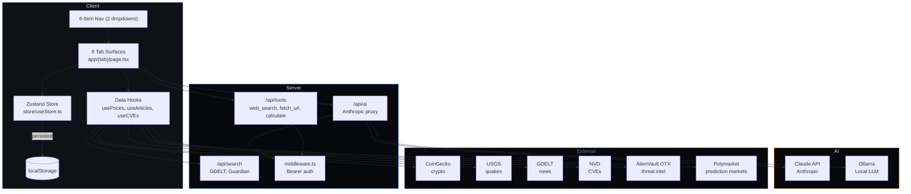
```mermaid
flowchart TD
    subgraph Client
        NAV["6-Item Nav (2 dropdowns)"] --> TABS["9 Tab Surfaces<br/>app/(tab)/page.tsx"]
        TABS --> STORE["Zustand Store<br/>store/useStore.ts"]
        STORE -->|persisted| LS[("localStorage")]
        TABS --> HOOKS["Data Hooks<br/>usePrices, useArticles, useCVEs"]
    end

    subgraph Server
        API_AI["/api/ai<br/>Anthropic proxy"]
        API_TOOLS["/api/tools<br/>web_search, fetch_url, calculate"]
        API_SEARCH["/api/search<br/>GDELT, Guardian"]
        MIDDLEWARE["middleware.ts<br/>Bearer auth"]
    end

    subgraph AI
        CLAUDE["Claude API<br/>Anthropic"]
        OLLAMA["Ollama<br/>Local LLM"]
    end

    subgraph External
        CG["CoinGecko<br/>crypto"]
        USGS["USGS<br/>quakes"]
        GDELT["GDELT<br/>news"]
        NVD["NVD<br/>CVEs"]
        OTX["AlienVault OTX<br/>threat intel"]
        POLY["Polymarket<br/>prediction markets"]
    end

    HOOKS --> API_SEARCH
    TABS --> API_AI
    TABS --> API_TOOLS
    API_AI --> MIDDLEWARE
    API_TOOLS --> MIDDLEWARE
    API_AI --> CLAUDE
    API_AI --> OLLAMA
    HOOKS --> CG
    HOOKS --> USGS
    HOOKS --> GDELT
    HOOKS --> NVD
    HOOKS --> OTX
    HOOKS --> POLY

    style Client fill:#0f1117,stroke:#1e2233,color:#dde1f0
    style Server fill:#07080d,stroke:#4f6ef7,color:#dde1f0
    style AI fill:#07080d,stroke:#d97706,color:#dde1f0
    style External fill:#07080d,stroke:#1e2233,color:#6875a0
```

---

## Stack

<div align="center">

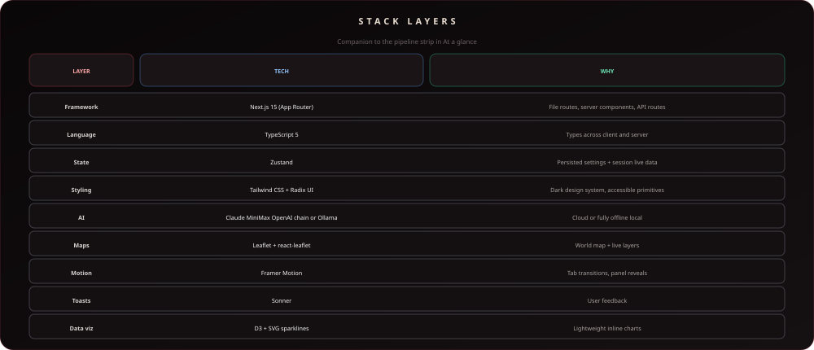

</div>

The graphic is the cheat sheet; in one line: **Next.js 14 App Router + TypeScript 5 + Zustand + Tailwind/Radix**, **server `/api/*` routes** for AI and tools (keys never shipped to the browser), **Leaflet** maps, **Framer Motion**, **Sonner**, **D3** sparklines. The pipeline strip under [At a glance](#at-a-glance) shows how data and LLM traffic flow.

---

## Quickstart

<div align="center">

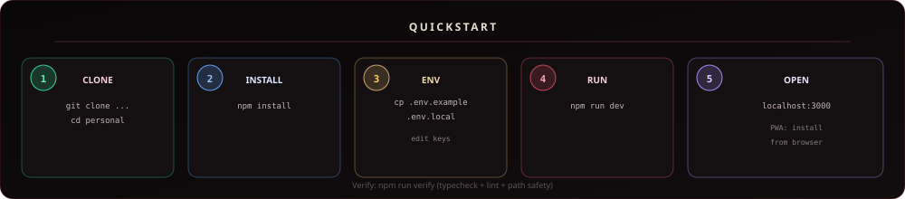

</div>

1. **Clone & install**

```bash
git clone <your-internal-repo-url>
cd <your-project-folder>
npm install
```

2. **Environment** — `cp .env.example .env.local`, then set at least:

```env
NEXUS_TOKEN=your-long-random-secret
ANTHROPIC_API_KEY=sk-ant-...
```

(Use [Local AI](#local-ai-fully-offline) instead of cloud keys if you want fully offline LLM.)

3. **Run** — `npm run dev` → [http://localhost:3000](http://localhost:3000). Missing *data* keys only quiet that feed.

4. **Verify** (before PRs) — `npm run verify` (typecheck, lint, path safety).

5. **PWA** — `public/manifest.json` + `public/icon.svg`; Chrome/Edge **Install**, or iOS Safari **Add to Home Screen**.

---

## API Keys

<div align="center">

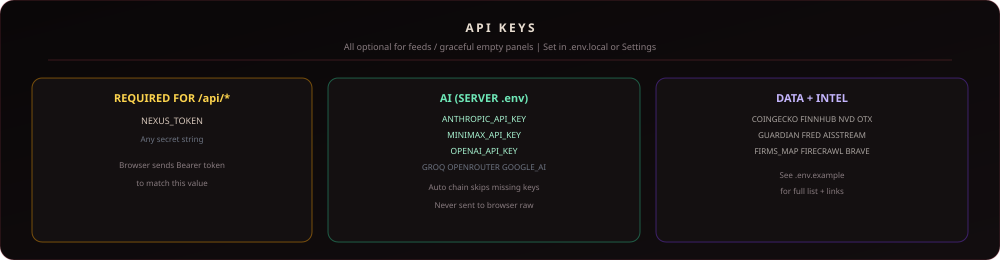

</div>

- **`NEXUS_TOKEN`** — Required for the browser to call `/api/*` (Bearer token). Pick any strong random string.
- **AI providers** — `ANTHROPIC_API_KEY`, `MINIMAX_API_KEY`, `OPENAI_API_KEY`, `GROQ_API_KEY`, `OPENROUTER_API_KEY`, `GOOGLE_AI_KEY`, etc. The server tries configured providers in order and skips missing keys.
- **Data / intel** — CoinGecko, Finnhub, Guardian, FRED, OTX, NVD, Firecrawl, Brave, AISstream, FIRMS, … all **optional**; the UI degrades gracefully.
- **Network mode controls** — `NEXUS_NETWORK_MODE=isolated|internal|connected` and `NEXUS_ENABLE_HIGH_RISK_TOOLS=true|false` gate which `/api/*` classes are allowed at runtime (default is safest: `isolated` + high-risk off).
- **Free-use safeguard** — paid AI providers are blocked by default; set `NEXUS_ALLOW_PAID_APIS=true` only when you explicitly choose to use paid APIs.
- **Connector policy override** — optional `NEXUS_CONNECTOR_POLICY_JSON` lets operators disable specific connectors (`{"news":true,"flights":false}`) without changing code.

**Canonical list with comments and signup links:** [`.env.example`](./.env.example).

---

## Local AI (fully offline)

<div align="center">

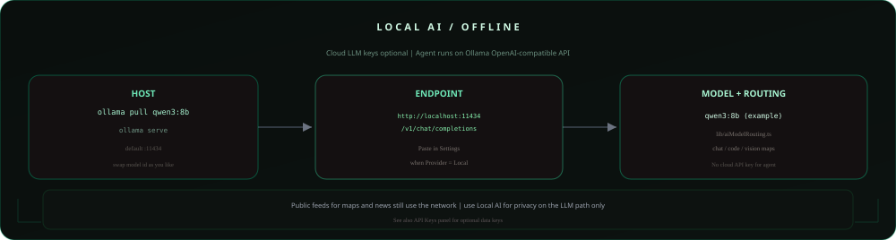

</div>

```bash
ollama pull qwen3:8b
# ollama serve  (listens on :11434 by default)
```

In the app: **Settings** → **Provider: Local** → endpoint `http://localhost:11434/v1/chat/completions` → model e.g. `qwen3:8b`. Optional per-task model mapping: `lib/aiModelRouting.ts`. Map/news layers still use the public internet unless you avoid those features.

---

## Self-hosting

<div align="center">

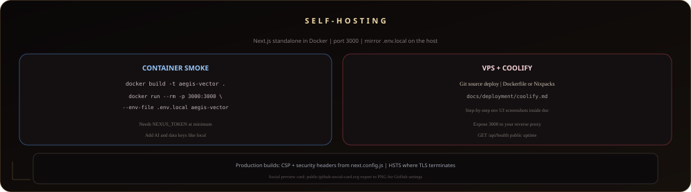

</div>

- **Coolify / VPS** — Full walkthrough: [`docs/deployment/coolify.md`](docs/deployment/coolify.md) (Git deploy, Dockerfile or Nixpacks, port **3000**, same env vars as local).
- **Docker smoke test**

```bash
docker build -t aegis-vector .
docker run --rm -p 3000:3000 --env-file .env.local aegis-vector
```

- **Health** — `GET /api/health` (public, no Bearer).
- **Hardening** — Non-dev builds get CSP and related headers from `next.config.js`.

---

## Desktop App (Windows & macOS)

Aegis Vector runs as a native desktop app via **Tauri** — no browser tab required, binds to `127.0.0.1` only by default.

```bash
# Build the Next.js standalone runtime first
npm run desktop:build-runtime

# Start the local runtime (127.0.0.1:3000)
npm run desktop:start-runtime

# Open Tauri dev shell
npm run desktop:tauri:dev
```

If `npm run desktop:tauri:dev` fails with `could not determine executable to run`, invoke the CLI explicitly:

```bash
cd desktop/src-tauri
npx --yes --package @tauri-apps/cli tauri dev
```

Security profile is controlled by two env vars:

```env
NEXUS_NETWORK_MODE=isolated   # isolated | internal | connected
NEXUS_ENABLE_HIGH_RISK_TOOLS=false
```

- **Scaffold & config** — `desktop/src-tauri/`
- **Security checklist** — [`docs/deployment/tauri-security-checklist.md`](docs/deployment/tauri-security-checklist.md)
- **Runbook** — [`docs/deployment/desktop-secured-runbook.md`](docs/deployment/desktop-secured-runbook.md)
- **Migration map** — [`docs/plans/desktop-app-secure-migration-map.md`](docs/plans/desktop-app-secure-migration-map.md)

---

## Project structure

<div align="center">

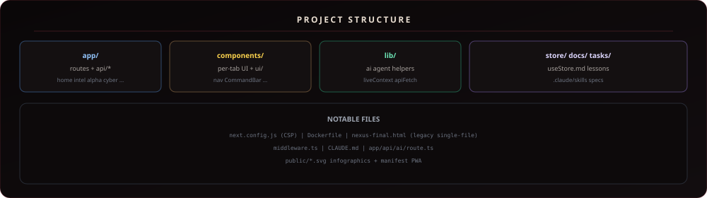

</div>

- **`app/`** — App Router routes (`command`, `signals`, `intel`, …) plus **`app/api/*`** 
