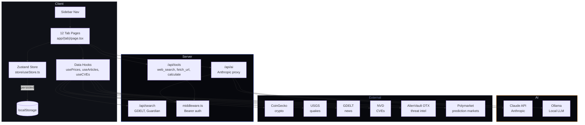

<div align="center">


<br>

[](https://nextjs.org)
[](https://typescriptlang.org)
[](https://tailwindcss.com)
[](https://anthropic.com)
[](https://platform.minimax.io)
[](https://ollama.ai)
[](LICENSE)

<br>

### At a glance *(GitHub’s short repo description is text-only — visuals live here)*


**Social preview (1280×640):** the repo card is [`public/github-social-card.svg`](./public/github-social-card.svg). In **GitHub → Settings → General → Social preview → Edit**, upload a **PNG or JPEG** (GitHub may not accept SVG there): open the SVG in a browser, export or screenshot at ~1280×640, then attach.

<br>

**A personal intelligence dashboard that runs entirely on your machine.**
Live crypto, geopolitical, cyber, and market data — plus free-tier intel maps, optional TradingView embeds, and a built-in AI agent (Claude, MiniMax, OpenAI chain, or local Ollama).

[Quickstart](#quickstart) · [Tabs](#tabs) · [AI Agent](#ai-agent) · [Stack](#stack) · [API Keys](#api-keys) · [Self-hosting](#self-hosting) · [Structure](#project-structure)

</div>

---

## What it is

**Free software (MIT) — Nexus does not charge you.** There are no subscriptions, paywalls, or in-app purchases in this app. Optional API keys are bring-your-own; if a provider bills you, that is between you and them, not Nexus.

Nexus Prime is a self-hosted intelligence dashboard. It pulls live data from dozens of sources and surfaces it across purpose-built tabs. An AI agent runs inside the app (Claude, MiniMax, cloud fallbacks, or local Ollama) with tool-use for research, analysis, and code edits. The **Field manual** (`/resources`) links curated external learning resources; `.env.local` stays gitignored.

No cloud backend. No database. Runs locally on `npm run dev`.

---

## Tabs

<table>
<tr>
<td width="50%" valign="top">

### ⚡ Command
KPI cards, Fear & Greed index, live BTC price, AI briefing, event predictor, deep research agent

### 📡 Signals
Live news (RSS + CryptoCompare + GDELT fallback; optional Guardian with API key). Bias tagging (bullish / bearish / neutral), article clusters, bookmarking

### 🎯 Alpha
Momentum scanner with RSI/BB/EMA scoring, Buy Bot signals, 7-day sparklines, position sizing calculator

### 🌍 Ops
Conflict tracker, interactive world map, FX rates, commodities, OSINT panels

### 📊 Intel
Polymarket prediction odds, Porter 5 Forces, VRIO framework, BCG Matrix, SaaS lifecycle tracker

### 🔒 Cyber
Live CVEs sorted by severity (CRITICAL → LOW), OTX threat intel, CISA advisories

</td>
<td width="50%" valign="top">

### 🗂 Vault
Saved articles, persisted across sessions via Zustand

### 🌐 World
Interactive Leaflet map with live layers: earthquakes (USGS), flights (OpenSky), ships (AISstream), fires (NASA FIRMS), GPS jamming

### 🔐 Security
Security posture monitoring and threat surface overview

### 🛠 Skills
Self-learning skill engine — agent reads, writes, and improves its own skill files

### 🚗 Vehicle
Vehicle tracking and telemetry data

### 📱 IoT
Device monitoring and live sensor feeds

</td>
</tr>
</table>

---

## AI Agent

The agent runs a full **ReAct (Reason + Act) loop** — it thinks, picks a tool, executes it, reads the result, and repeats until it has an answer.


```mermaid
flowchart LR
    U([User message]) --> A[Agent\nlib/agent.ts]
    A --> T{Pick tool}
    T --> W[web_search]
    T --> F[fetch_url]
    T --> R[read_file]
    T --> C[calculate]
    W --> O[Tool result]
    F --> O
    R --> O
    C --> O
    O --> A
    A -->|Done| S([Stream to UI])
    style A fill:#151820,stroke:#4f6ef7,color:#dde1f0
    style T fill:#151820,stroke:#7c3aed,color:#dde1f0
    style S fill:#151820,stroke:#10b981,color:#dde1f0
```

Tool calls appear as collapsible badges in the chat UI in real time. The agent works with Claude (server-side key, never exposed to the client) or a local Ollama model for fully offline use.

---

## Architecture


```mermaid
flowchart TD
    subgraph Client
        NAV["Sidebar Nav"] --> TABS["12 Tab Pages<br/>app/(tab)/page.tsx"]
        TABS --> STORE["Zustand Store<br/>store/useStore.ts"]
        STORE -->|persisted| LS[("localStorage")]
        TABS --> HOOKS["Data Hooks<br/>usePrices, useArticles, useCVEs"]
    end

    subgraph Server
        API_AI["/api/ai<br/>Anthropic proxy"]
        API_TOOLS["/api/tools<br/>web_search, fetch_url, calculate"]
        API_SEARCH["/api/search<br/>GDELT, Guardian"]
        MIDDLEWARE["middleware.ts<br/>Bearer auth"]
    end

    subgraph AI
        CLAUDE["Claude API<br/>Anthropic"]
        OLLAMA["Ollama<br/>Local LLM"]
    end

    subgraph External
        CG["CoinGecko<br/>crypto"]
        USGS["USGS<br/>quakes"]
        GDELT["GDELT<br/>news"]
        NVD["NVD<br/>CVEs"]
        OTX["AlienVault OTX<br/>threat intel"]
        POLY["Polymarket<br/>prediction markets"]
    end

    HOOKS --> API_SEARCH
    TABS --> API_AI
    TABS --> API_TOOLS
    API_AI --> MIDDLEWARE
    API_TOOLS --> MIDDLEWARE
    API_AI --> CLAUDE
    API_AI --> OLLAMA
    HOOKS --> CG
    HOOKS --> USGS
    HOOKS --> GDELT
    HOOKS --> NVD
    HOOKS --> OTX
    HOOKS --> POLY

    style Client fill:#0f1117,stroke:#1e2233,color:#dde1f0
    style Server fill:#07080d,stroke:#4f6ef7,color:#dde1f0
    style AI fill:#07080d,stroke:#d97706,color:#dde1f0
    style External fill:#07080d,stroke:#1e2233,color:#6875a0
```

---

## Stack

| Layer | Tech | Why |
|-------|------|-----|
| Framework | Next.js 14 (App Router) | File-based routing, server components, API routes |
| Language | TypeScript 5 | Full type safety across client and server |
| State | Zustand | Persisted settings + session-only live data, no boilerplate |
| Styling | Tailwind CSS + Radix UI | Dark design system, accessible primitives |
| AI | Anthropic Claude or Ollama | Flexible — cloud or fully offline |
| Maps | Leaflet + react-leaflet | Interactive world map with live data layers |
| Animation | Framer Motion | Tab transitions, panel reveals |
| Notifications | Sonner | Toast system |
| Data viz | D3 + SVG sparklines | Lightweight inline charts |

---

## Quickstart

**1. Clone and install**

```bash
git clone https://github.com/mad818/personal.git
cd personal
npm install
```

**2. Configure environment**

```bash
cp .env.example .env.local
```

Edit `.env.local` with at minimum:

```env
ANTHROPIC_API_KEY=sk-ant-...   # for the AI agent
NEXUS_TOKEN=any-string          # protects /api/* routes
```

**3. Run**

```bash
npm run dev
```

Open [localhost:3000](http://localhost:3000). All tabs work — keys missing means that data source falls back silently.

**4. Install as app (optional)** — PWA metadata is in `public/manifest.json` with `public/icon.svg`. In Chrome or Edge, use **Install** from the address bar; on iPhone, open in Safari → **Add to Home Screen**.

---

## Self-hosting

To run Nexus on your own VPS (e.g. with [Coolify](https://github.com/coollabsio/coolify)), see **[docs/deployment/coolify.md](docs/deployment/coolify.md)** — Git source, **Dockerfile** or Nixpacks, port **3000**, and which env vars to set in the host UI.

Local smoke test with Docker: `docker build -t nexus-prime .` then `docker run --rm -p 3000:3000 --env-file .env.local nexus-prime` (ensure `.env.local` exists and includes `ANTHROPIC_API_KEY` and `NEXUS_TOKEN`).

---

## Local AI (fully offline)

```bash
ollama pull qwen3:8b
```

Then open **Settings** in the app, set provider to Local, endpoint to `http://localhost:11434/v1/chat/completions`, and model to `qwen3:8b`. No API key needed.

---

## API Keys

All keys are optional. The app degrades gracefully when a key is absent.

| Variable | Service | Free tier | Get one |
|----------|---------|-----------|---------|
| `ANTHROPIC_API_KEY` | Claude AI (agent + chat) | Your account with Anthropic (Nexus does not bill you) | [console.anthropic.com](https://console.anthropic.com) |
| `GROQ_API_KEY` | Groq (fast inference) | Yes | [console.groq.com](https://console.groq.com/keys) |
| `NEXUS_TOKEN` | Internal API auth | n/a | Set any string |
| `COINGECKO_KEY` | CoinGecko (crypto prices) | Yes | [coingecko.com/api](https://www.coingecko.com/en/api) |
| `FINNHUB_KEY` | Finnhub (stock quotes) | Yes | [finnhub.io](https://finnhub.io) |
| `GUARDIAN_KEY` | The Guardian (news) | Yes | [open-platform.theguardian.com](https://open-platform.theguardian.com) |
| `OTX_KEY` | AlienVault OTX (threat intel) | Yes | [otx.alienvault.com](https://otx.alienvault.com) |
| `FIRECRAWL_KEY` | Firecrawl (web scraper) | Yes | [firecrawl.dev](https://firecrawl.dev) |
| `NVD_KEY` | NVD (CVE feed) | Yes | [nvd.nist.gov/developers](https://nvd.nist.gov/developers/request-an-api-key) |
| `AISSTREAM_KEY` | AISstream (live ship tracking) | Yes | [aisstream.io](https://aisstream.io) |
| `FIRMS_MAP_KEY` | NASA FIRMS (fire hotspots) | Yes | [firms.modaps.eosdis.nasa.gov](https://firms.modaps.eosdis.nasa.gov/api/area/) |

---

## Project Structure

```
app/                        ← one route per tab (Next.js App Router)
├── command/                ← ⚡ Command tab
├── signals/                ← 📡 Signals tab
├── alpha/                  ← 🎯 Alpha tab
├── ops/                    ← 🌍 Ops tab
├── intel/                  ← 📊 Intel tab
├── cyber/                  ← 🔒 Cyber tab
├── vault/                  ← 🗂 Vault tab
├── api/                    ← server routes (ai, tools, search, ...)
└── layout.tsx              ← root layout (AuthGate + Nav)

components/                 ← one folder per tab + shared UI
├── ui/                     ← buttons, cards, inputs (Radix primitives)
├── system/                 ← DataLoader, ErrorBoundary, ThemeProvider
└── nav/                    ← sidebar navigation

store/
└── useStore.ts             ← Zustand store: settings (persisted) + live data

lib/
├── ai.ts                   ← callAI, streamAI, buildSystemPrompt
├── agent.ts                ← ReAct agent loop with tool use
└── helpers.ts              ← fmtPrice, fmtVol, timeAgo, esc

.claude/skills/             ← project-level agent skills
├── add-feature/SKILL.md
├── add-tab/SKILL.md
├── add-api/SKILL.md
└── fix-bug/SKILL.md

tasks/
├── todo.md                 ← active task list
└── lessons.md              ← rules from past corrections

Dockerfile                  ← production image (Next standalone, port 3000)
.dockerignore

docs/
├── architecture.md
├── expansion-plan.md
├── deployment/
│   └── coolify.md          ← optional VPS deploy with Coolify
└── ideas/
    └── assimilated-ecosystem.md
```

---

## License

MIT
