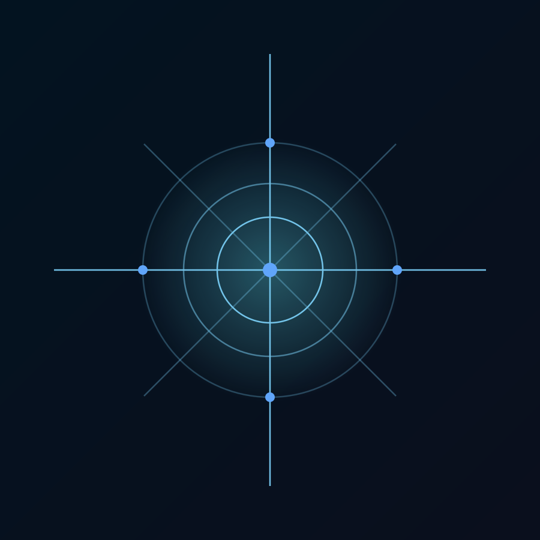
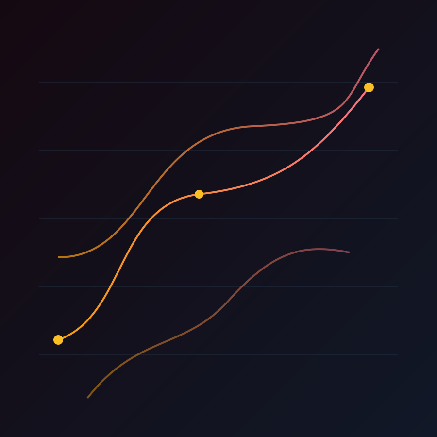
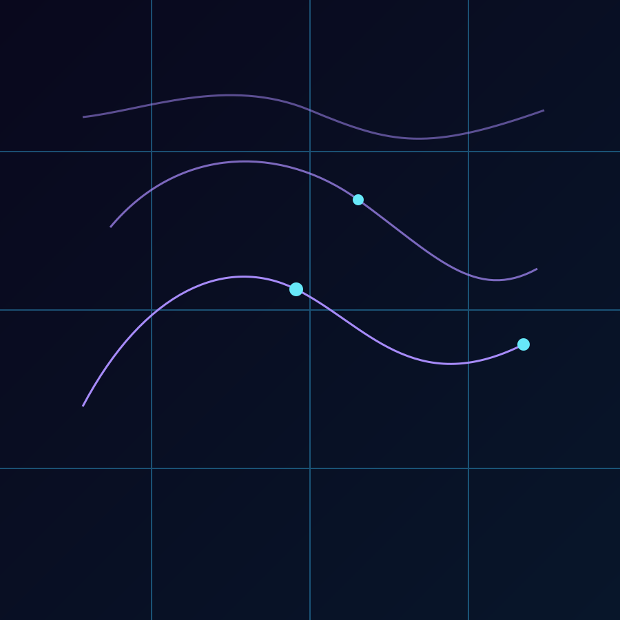
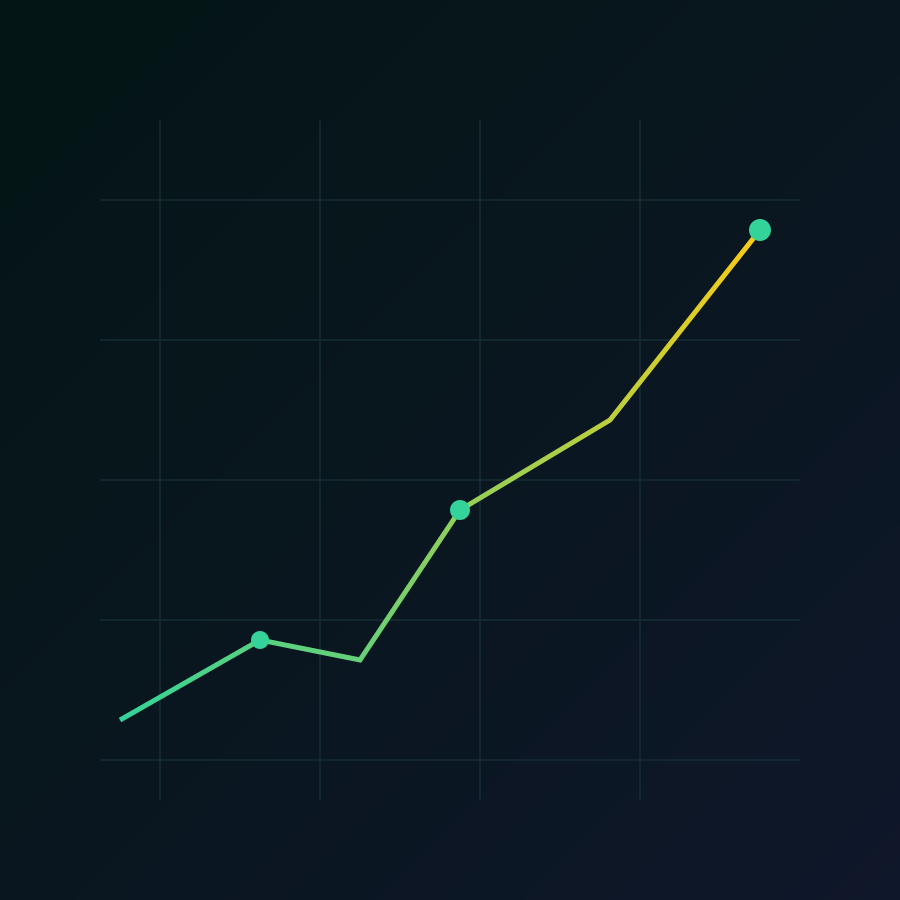
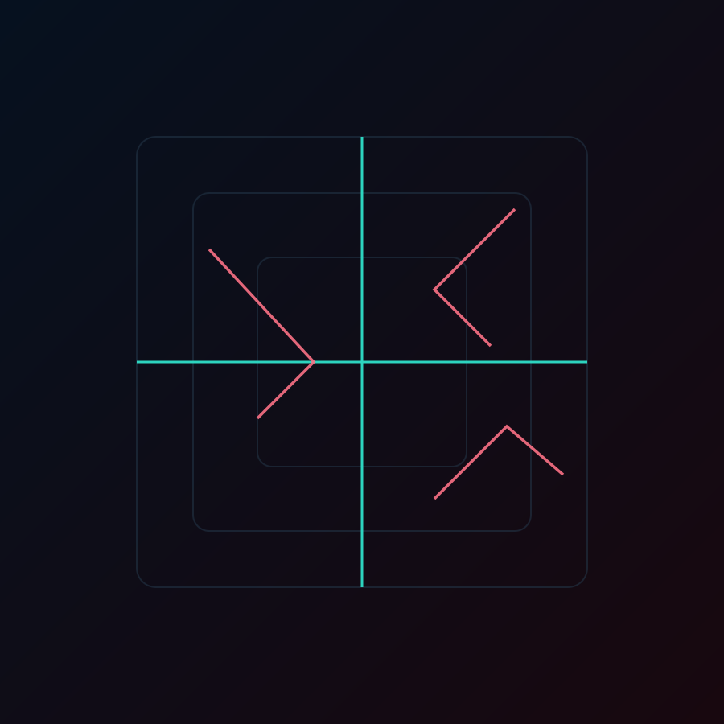
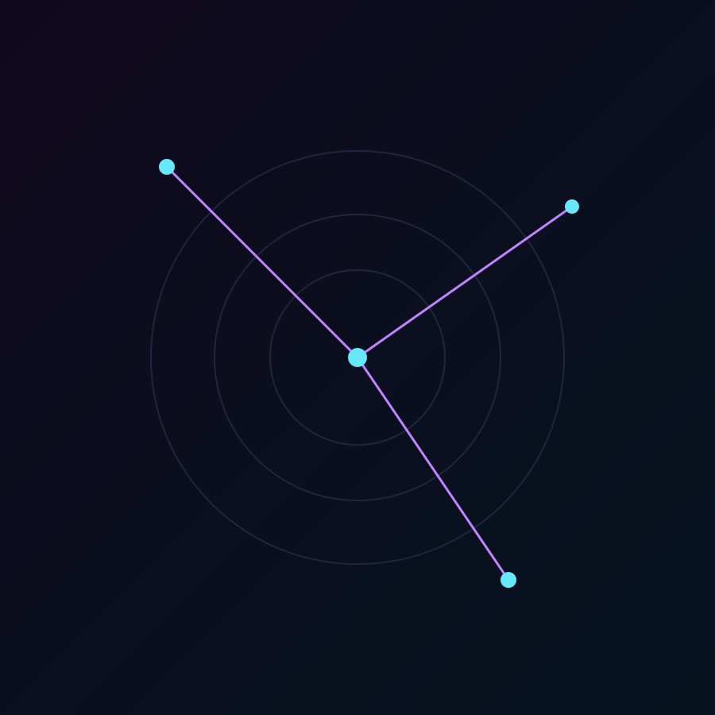
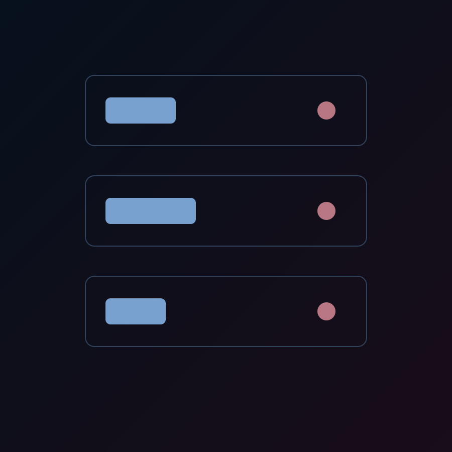
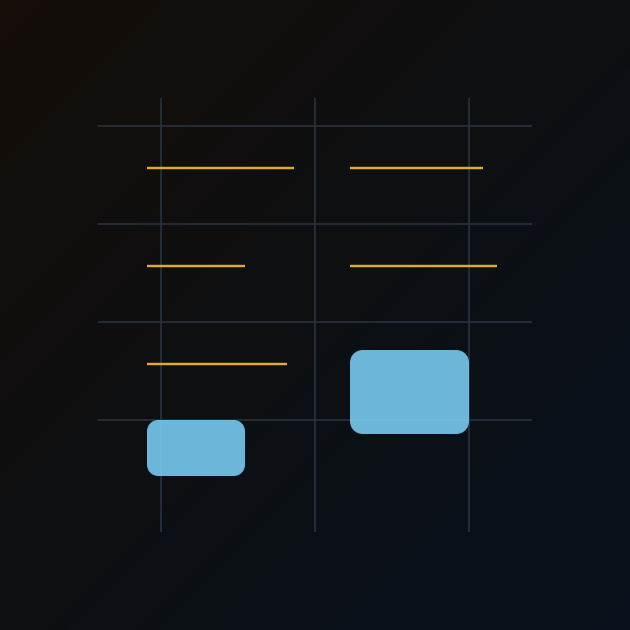
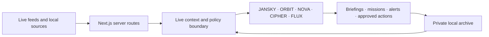

<div align="center">


# Nexus Prime

**A local-first command-and-intelligence workspace for turning live signals into informed action.**

[](https://nextjs.org)
[](https://react.dev)
[](https://typescriptlang.org)
[](desktop/README.md)
[](LICENSE)

[Product tour](#product-tour) · [Quickstart](#quickstart) · [Trust model](#trust-model) · [Architecture](#how-it-works) · [Development](#development)

</div>

## What Nexus Prime does

Nexus Prime brings markets, world events, cyber intelligence, open-source research, automation, local notes, and AI-assisted analysis into one operator-owned workspace. Instead of switching among disconnected feeds and tools, you can move through one repeatable loop:

1. **Observe** live signals and source material.
2. **Understand** them with focused dashboards and five specialist agents.
3. **Act** through missions, schedules, alerts, and approval-gated tools.
4. **Retain** useful evidence and decisions in a private local archive.

The application runs on your machine in a browser or a native Tauri window. Local AI through Ollama is the default path; optional cloud providers and connectors are bring-your-own-key.

## Product tour

Nexus Prime ships eight general-availability surfaces. Each one has a distinct job while sharing the same agent, live-context, security, and archive foundations.

<table>
  <tr>
    <td width="50%">
      
      <h3><a href="./app/hq/page.tsx">CITADEL · HQ</a></h3>
      <p>Your operator home: system posture, agent control, briefings, and the fastest path into active work.</p>
    </td>
    <td width="50%">
      
      <h3><a href="./app/command/page.tsx">VECTOR · COMMAND</a></h3>
      <p>Mission control for plans, schedules, alerts, runtime efficiency, and approval-gated operations.</p>
    </td>
  </tr>
  <tr>
    <td width="50%">
      
      <h3><a href="./app/intel/page.tsx">SPECTRA · INTEL</a></h3>
      <p>News, world risk, theater sweeps, maps, and strategic intelligence with visible source provenance.</p>
    </td>
    <td width="50%">
      
      <h3><a href="./app/alpha/page.tsx">QUANT · ALPHA</a></h3>
      <p>Markets, scanners, sentiment, rates, and decision support that distinguishes verified data from unavailable data.</p>
    </td>
  </tr>
  <tr>
    <td width="50%">
      
      <h3><a href="./app/cyber/page.tsx">BASTION · CYBER</a></h3>
      <p>Cyber intelligence, threat monitoring, defensive triage, and security posture in one focused surface.</p>
    </td>
    <td width="50%">
      
      <h3><a href="./app/recon/page.tsx">PARALLAX · RECON</a></h3>
      <p>Open-source research and free-first connectors with server-side boundaries around external requests.</p>
    </td>
  </tr>
  <tr>
    <td width="50%">
      
      <h3><a href="./app/vault/page.tsx">ARCHIVE · VAULT</a></h3>
      <p>A local home for articles, artifacts, research history, and durable context you choose to keep.</p>
    </td>
    <td width="50%">
      
      <h3><a href="./app/resources/page.tsx">FIELD MANUAL · RESOURCES</a></h3>
      <p>Curated references and operational guidance for understanding and extending the workspace.</p>
    </td>
  </tr>
</table>

### Specialist agents

The workspace routes work through five named roles rather than one generic assistant:

| Agent | Focus |
| --- | --- |
| **JANSKY** | Strategy, planning, and mission orchestration |
| **ORBIT** | Engineering and implementation |
| **NOVA** | Research, news, and evidence gathering |
| **CIPHER** | Security intelligence and defensive review |
| **FLUX** | Markets, macroeconomics, and probability-based analysis |

Every provider call goes through the same server-side AI boundary, so local and optional cloud models share one policy, context, and audit path.

## Trust model

Nexus Prime is designed for a private, self-hosted workspace:

- **Free and MIT licensed.** There are no Nexus subscriptions, in-app purchases, or Nexus-side billing.
- **Local-first storage.** Your runtime state and archive remain under your control.
- **Local AI first.** Ollama works without a cloud-model account.
- **Explicit BYOK.** Optional cloud models and external connectors use keys you supply.
- **Server-side secrets.** Keys belong in `.env.local`; browser code does not receive them.
- **Controlled networking.** Isolated, free-only, and full network modes make outbound access an operator choice.
- **Approval-gated actions.** High-risk tools do not silently execute.
- **No invented data.** Failed external feeds surface as unavailable instead of being replaced with manufactured neutral values.

See the [architecture](./docs/architecture.md), [deployment guidance](./docs/deployment/README.md), and [security documentation](./docs/security/) for the deeper operational model.

## Quickstart

### Requirements

- [Node.js 24](https://nodejs.org/) and npm 11
- Git
- Optional: [Ollama](https://ollama.com/) for private local AI

### Install

```powershell
git clone https://github.com/mad818/personal.git
cd personal
npm install
Copy-Item .env.example .env.local
```

On macOS or Linux, replace the last command with:

```bash
cp .env.example .env.local
```

Set a private access token in `.env.local`:

```dotenv
NEXUS_TOKEN=your-token
```

Replace `your-token` with a long, unique secret. Do not commit `.env.local`.

### Start

On Windows, double-click `NexusPrime.bat`, or run:

```powershell
npm run operational:start
```

`npm run operational:start` opens [HQ](http://localhost:3000/hq) only after `/api/health` confirms that the local runtime is ready.

To check readiness without launching the application:

```powershell
npm run operational:start -- --check
```

Enter the `NEXUS_TOKEN` value on the access screen. The session is stored in a secure local cookie.

## Local and optional AI

For an offline-first setup:

```powershell
ollama pull qwen3:8b
ollama serve
```

Then choose Ollama in Nexus settings. The full local model setup and verification path is documented in [ollama-huggingface-local.md](./docs/deployment/ollama-huggingface-local.md).

Optional providers, including Azure OpenAI and OpenAI-compatible endpoints, are configured through `.env.local`. Copy only the variables you need from [.env.example](./.env.example). Paid-compatible lanes remain blocked unless you explicitly enable them.

## How it works

Nexus Prime uses **Next.js 15 / React 19** for the application shell, with the **Next.js 15 App Router + React 19** providing the server boundary. TypeScript defines the contracts, Zustand holds client state, Tailwind CSS and Radix UI handle presentation, and Tauri packages the native Windows and macOS app.


```mermaid
flowchart LR
    A["Live feeds and local sources"] --> B["Next.js server routes"]
    B --> C["Live context and policy boundary"]
    C --> D["JANSKY · ORBIT · NOVA · CIPHER · FLUX"]
    D --> E["Briefings · missions · alerts · approved actions"]
    E --> F["Private local archive"]
    F --> C
```

External APIs are proxied through `app/api/`; AI requests flow through `lib/ai.ts`; live context is assembled in `lib/liveContext.ts`; and the agent/tool loop lives in `lib/agent.ts`.

## Desktop app

The same workspace can run in a native Tauri shell for Windows and macOS:

```powershell
npm run desktop:build-runtime
npm run desktop:start-runtime
npm run desktop:tauri:dev
```

See [desktop/README.md](./desktop/README.md) for prerequisites, security posture, and packaging details.

## Project map

- **`app/`** — Next.js routes, layouts, and protected server API boundaries
- **`components/`** — shared shell plus route-specific interface components
- **`lib/`** — agents, AI routing, live context, policies, security, and integrations
- **`store/`** — typed Zustand application state
- **`desktop/`** — Tauri native shell and packaged-runtime configuration
- **`public/`** — product artwork, icons, and static assets
- **`docs/`** — architecture, deployment, security, operating, and release guidance
- **`tasks/`** — active work, completed milestones, and lessons from prior corrections

Beta labs and internal hardware/operations routes live outside the eight GA surfaces and are intentionally not presented as finished product areas.

## Development

Start the development server:

```powershell
npm run dev
```

Run the canonical local verification lane:

```powershell
npm run verify
```

Useful focused checks:

```powershell
npm run type-check
npm run build
npm run hq:e2e
```

Repository instructions and current handoff state live in [AGENTS.md](./AGENTS.md) and [docs/AGENT_HANDOFF.md](./docs/AGENT_HANDOFF.md).

## License

[MIT](./LICENSE). Nexus Prime is free software; optional third-party services keep their own terms and usage costs.
